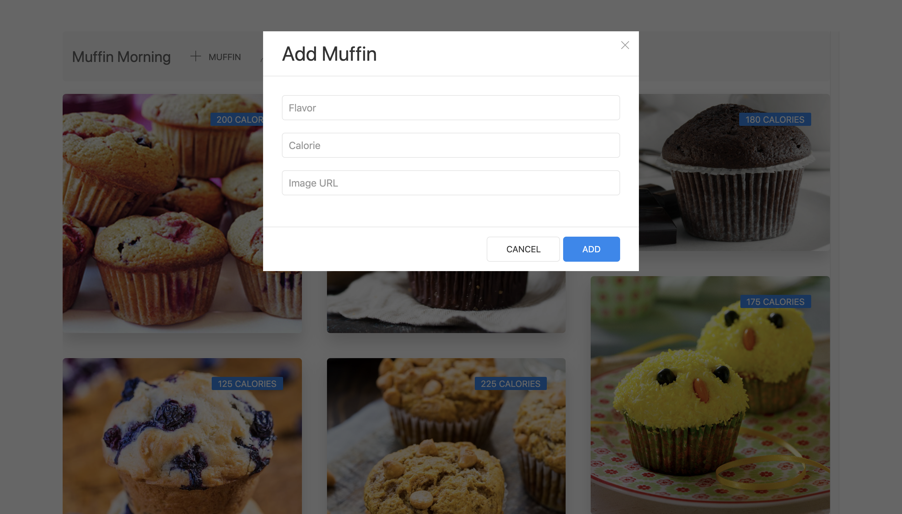
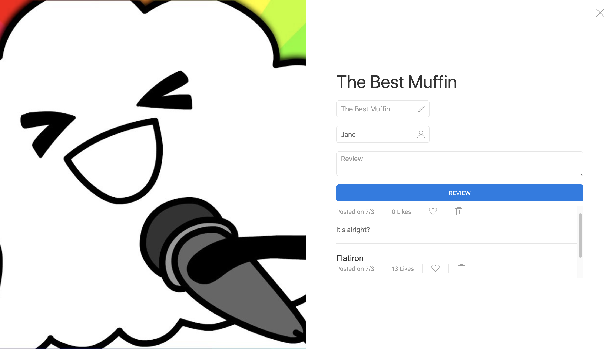
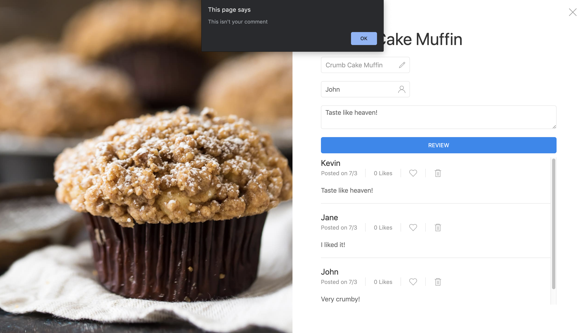

# Muffin Mornings

Web app where users can post, review and like muffin reviews. [*Muffin Mornings Backend*](https://github.com/kangyongn/muffin_mornings_backend)
## Project Aim
1. Create a dynamically rendering web app by converting previous Ruby on Rails projects using JavaScript.
2. Create a custom Rails backend to function alongside a JavaScript frontend.
2. Implement full CRUD actions.
3. Implement mock login function.
5. Implement UI Kit library for styling.

## Muffin Mornings' Design
1. Users can post and review muffins.
2. When posting a new muffin, users are able to input an image, name, and calories count of the muffin.

3. Users are able to view and review muffins they've posted along with muffins posted by other users.
4. Users are able to like reviews.

5. Using a mock login function, users are only able to remove reviews, they've posted.

## Resources Used
* JavaScript
* Ruby on Rails
* UI Kit
